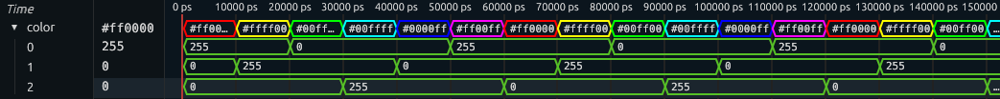

## How to add translations for difficult to unpack types
Sometimes, you find yourself face to face with a type that cannot be represented
properly using the standard translators - or the implementation is simply too much work.
In that case, you may consider using _lookup tables_.

When using LUTs, Shockwaves stores a table of translations rather than a description
of how to create a translation.
Typically, Shockwaves translates all values of types that use LUTs during simulation
and stores these translations along with the translators, but it is also possible to
pre-populate the translation table. In the waveform viewer, translations are
simply retreived using the binary representations in the VCD file.

Since using LUTs is generally much simpler than doing a full `Waveform` implementation,
Shockwaves provides the `WaveformLUT` class that has some functions for making the process
easier. To connect the instance of `Waveform` to that of `WaveformLUT`, it can be derived
via `WaveformForLut`.

There are two ways to use `WaveformLUT`: you either create a static LUT, providing all
translations yourself, or you create a generated LUT by providing a translation function.

A generated LUT implementation requires two functions:
`structureL` to provide the subsignal structure,
and `translateL` to create the translation of a runtime value.
A static LUT simply needs a single LUT to be defined under `staticL`.

By default, `WaveformLUT` creates a generated LUT.
It uses the standard `Generic`-based functions to create subsignals,
and `Show` to determine the value.

> **Important:** Using LUTs has several drawbacks. Any miniscule change to the data type
> will result in a completely new translation being stored, which is bad for container types
> that may be very large or contain large values. Secondly, the lookup table only has the binary
> representation of the data type available: as such, `undefined` is indistinguishable from
> `(undefined,undefined)`, even though they are different values in Haskell. Shockwaves first
> converts value to binary and then reconstructs them to guarantee that the translations
> accurately match the values in the VCD file. This does however mean that they are not direct
> translations of the values that occur in simulation!


### STATIC LUTS

Creating a static LUT is really easy, and works best when you have a "small" data type
for which you can easily define translations for all values.
Simply add a list of value-translation pairs under `staticL`.

Since the default implementations for `structureL` and `translateL` have some constraints,
it's best to set them to `undefined`.

Currently, `Bit` uses a static LUT. The implementation is as follows:

```hs
instance WaveformLUT Bit where
  staticL =
    Just
      [ (     high, Translation (Just ("1", "$bit_high", 11)) [])
      , (      low, Translation (Just ("0",  "$bit_low", 11)) [])
      , (undefined, Translation (Just ("x",      WSWarn, 11)) [])
      ]
  structureL = undefined
  translateL = undefined
```

`WaveformLUT` creates a static LUT if `staticL` is `Just lut`,
and a generated LUT if `staticL` is `Nothing`.


### GENERATED LUTS: CHANGING THE RENDER VALUE

Since `WaveformLUT` uses `Show` by default, it's very easy to change the text value of a signal:
derive `Waveform` via `WaveformForLut`, create a `WaveformLUT` instance,
and simply overwrite `Show`:

```hs
data MyEither a b c = Left a | Middle b | Right c
  deriving (BitPack,Generic,Typeable,NFDataX)
  deriving Waveform via (WaveformForLut (MyEither a b c))

instance (Show a, Show b, Show c) => Show (MyEither a b c)
  showsPrec d (Left   x) = showParen (d > 10) $ showString "L " . showsPrec 11 x
  showsPrec d (Middle x) = showParen (d > 10) $ showString "M " . showsPrec 11 x
  showsPrec d (Right  x) = showParen (d > 10) $ showString "R " . showsPrec 11 x

instance WaveformLUT MyEither
```

If you want to change more, we need to first look at the default implementation
of `translateL`:

```hs
translateL :: a -> Translation
default translateL :: (Generic a, Show a, WaveformG (Rep a ()), PrecG (Rep a ())) => a -> Translation
translateL = translateWith renderShow splitL
```

`translateWith` splits the translation functionality into the creation of a render value,
and the creation of subsignals.

`renderShow` is defined as `renderWith show (const WSNormal) precL`: to create a render value,
call `show` for the label, `const WSNormal` for the style, and `precL` for the operator precedence.

`splitL` uses `WaveformG` to create a structure like the standard translator, but uses the render value
for the toplevel and constructor render values.


Since a simple value with `WSNormal` and precedence `11` is fairly common (for floats, for example),
there are a few special translation functions for these cases: `translateAtomWith`, `translateAtomShow`,
`translateAtomSigWith`, `translateAtomSigShow`. The `*Sig*` variants are for
signed numbers and take the operator precedence of the minus sign into account.


Let's look at another example. Say we have a color value,
and want to actually show the waveform in this color. We can
then write a `WaveformLUT` implementation that assigns a
custom color style to each value individually.

```hs
import Clash.Shockwaves.Style

data MyRGB = MyRGB Int Int Int
  deriving (Generic,Typeable,NFDataX,BitPack)
  deriving Waveform via WaveformForLut MyRGB

hex n = showHex (n `div` 16) . showHex (n `rem` 16)

instance Show MyRGB where
  show (MyRGB r g b) = ("#" <>) . hex r . hex g . hex b $ ""

colorStyle (MyRGB r g b) =
  WSColor $ RGB (fromIntegral r)
                (fromIntegral g)
                (fromIntegral b)

instance WaveformLUT MyRGB where
  translateL = translateWith (renderWith show colorStyle (const 11)) splitL
```



### GENERATED LUTS: CHANGING THE SUBSIGNALS

To change the subsignals, you need two things:
- to define the structure
- to translate values into subsignal translations

By default, this is implemented the same way as the default `Waveform` instances:
using `Generic`, but this is not always what you want. Let's say that for our
`MyRGB` data type, we want to label the color channel subsignals, and
display them in their own colors.

First, we need to define the structure. Our data type has three subsignals, called
`red`, `blue` and `green`, which each do not have subsignals. We write:

```hs
structureL = Structure
  [ ("red"  , Structure [])
  , ("green", Structure [])
  , ("blue" , Structure []) ]
```

Now we simply have to translate the values! It is extremely important that the
translations match the structure, or Surfer might crash! Matching here means we have no
signals that are not present int the structure - leaving _out_ signals is fine.

```hs
import Clash.Shockwaves.Internal.Translator (applyStyle)
```
```hs
translateL = translateWith (renderWith show colorStyle (const 11)) splitColor
  where
    splitColor _ (MyRGB r g b) =
      [ ("red"  , applyStyle (WSColor (RGB r' 0  0 )) $ translate $ r)
      , ("green", applyStyle (WSColor (RGB 0  g' 0 )) $ translate $ g)
      , ("blue" , applyStyle (WSColor (RGB 0  0  b')) $ translate $ b) ]
      where
        r' = fromIntegral r
        g' = fromIntegral g
        b' = fromIntegral b
```

> Note that `MyRGB undefined 0 0` will show up as `undefined`,
> since the both the split and style functions fail.
> Making the subsignals show up is relatively easy: instead of
> deconstructing the `MyRGB` value in `splitColor`, create lazily accessed
> value and pass these to `translate` and `applyStyle`.
> If one of the channels is undefined, `translate` will neatly return
> a translation with the `WSError` style, which is not replaced by
> the partially undefined style by `applyStyle`.
> ```hs
> splitColor rgb =
>   [ ("red"  , applyStyle (WSColor (RGB r 0 0)) $ translate $ r)
>   , ("green", applyStyle (WSColor (RGB 0 g 0)) $ translate $ g)
>   , ("blue" , applyStyle (WSColor (RGB 0 0 b)) $ translate $ b) ]
>   where
>     r = (\(MyRGB r _ _) -> fromIntegral r) rgb
>     g = (\(MyRGB _ g _) -> fromIntegral g) rgb
>     b = (\(MyRGB _ _ b) -> fromIntegral b) rgb
> ```


If we look at our type in the waveform viewer now, we see:


